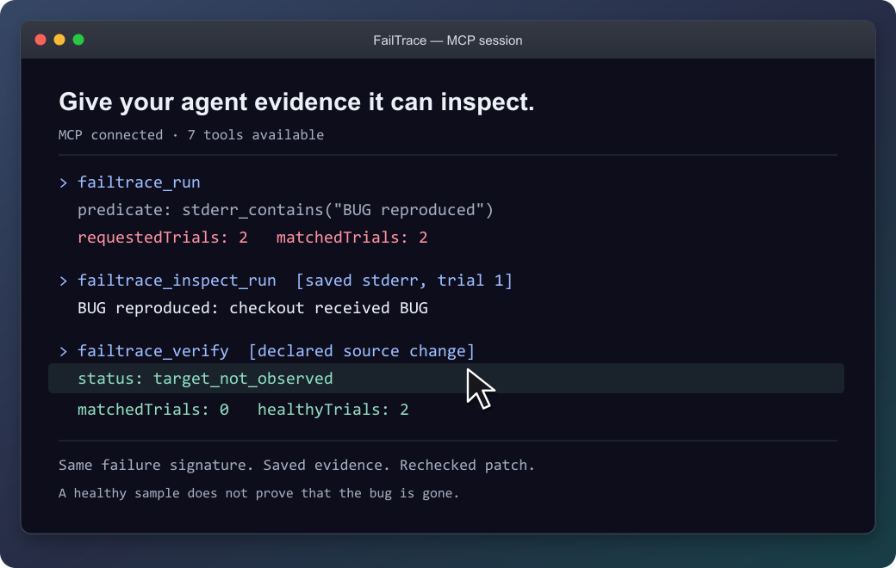
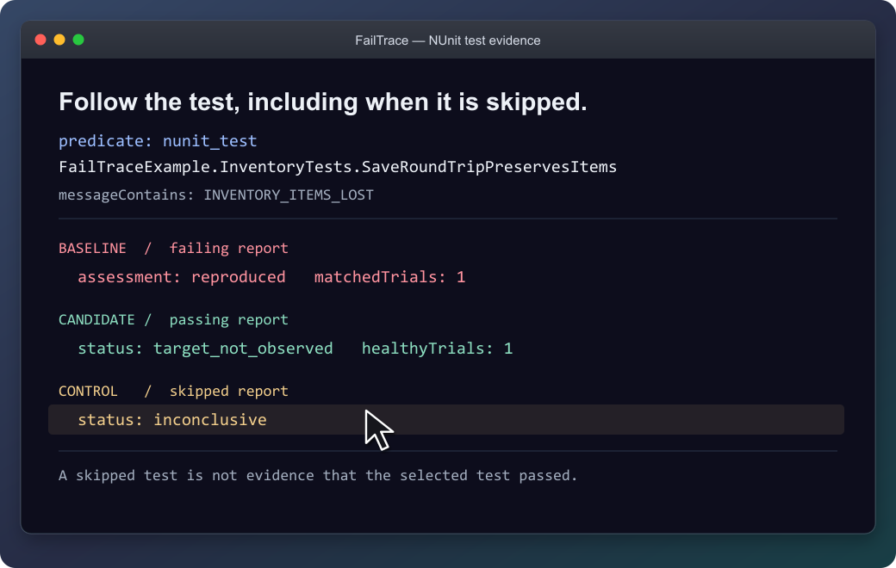
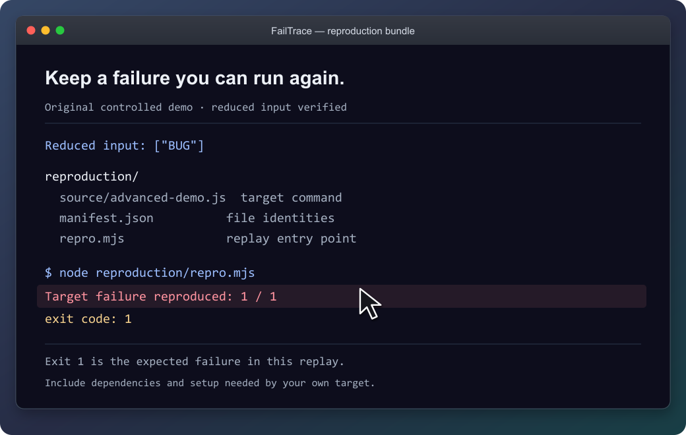

# FailTrace

**Reproduce the failure. Check the fix.**

A test fails intermittently. Your coding agent changes the code. One passing retry leaves you guessing.

FailTrace repeats the same check, saves a failing baseline, and checks the proposed fix against it. Use the **CLI or MCP tools** to get trial results, a smaller reproducer, and evidence your agent can inspect before accepting a patch.

[](https://github.com/LBarimi/FailTrace/actions/workflows/ci.yml) [](LICENSE)

Local execution. No AI API, account, or telemetry required. Keep your existing test runner and assertions.

## Quick start

With **Node.js 22.12+ and npm**, run this in any working directory:

```sh
npx --yes failtrace@1.4.0 demo
```


Original recorded results, presented in macOS-style windows with added pointers. Output is abridged and GIF timing edited. [Static walkthrough](docs/assets/demo.svg) · [Static poster](docs/assets/demo-poster.png) · [Recording details](docs/DEMO.md)

The demo reduces six input items to `["BUG"]`, rejects a patch that crashes for another reason, and checks a working patch. It saves the evidence in `.failtrace/` and prints a replay command. These are example outcomes, not performance measurements; a passing sample does not prove a bug is gone.

## For coding agents

Connect the local stdio MCP server through your client's configuration:

```sh
npx --yes failtrace@1.4.0 mcp --cwd "/absolute/path/to/your/project"
```

**[Copy the MCP configuration and check the connection →](docs/AGENT-WORKFLOWS.md#mcp-client-configuration-and-windows-paths)**

Your client launches this command. Running it alone in a terminal waits for MCP requests. The guide includes Windows setup.

Then ask your agent:

> Use FailTrace to capture this test failure before editing. Choose the exact test or failure message, save a bounded baseline, and inspect the matching trial. After the change, verify against that baseline and explain any unrelated errors or incomplete evidence.

The seven MCP tools share the CLI's Core engine. They retain the failure signature and investigation evidence across repetition, comparison, regression search, minimization, verification and replay. Agents can retrieve saved trial and log pages without rerunning the command. Shell-capable agents can also use the CLI with `--json`.



Actual tool-response excerpts from an original fixture. The agent can inspect the saved failure before checking the patch.

## Recheck an existing unit test

**Follow an exact NUnit or Unity test through a fix.** Each attempt gets a fresh NUnit 3 report. Missing or skipped tests and unrelated failures stay inconclusive, so an agent cannot accept them as evidence that the selected test passed.

[Connect your test or try the original EditMode example →](docs/UNIT-TESTS.md)

NUnit support is included in 1.3.0 through CLI and MCP. The documented Unity validation covers the Windows EditMode example.



Recorded NUnit 3 report controls. The selected test stays the same; a skipped report is not accepted as a passing test.

## Use it on your own failure

From your project, replace the command and message with your own:

```sh
npx --yes failtrace@1.4.0 run "npm test -- checkout" --repeat 20 --stderr-contains "checkout failed"
```

Each trial saves its output. Exit `1` can mean the target failure was recorded; inspect the result before retrying. To check a patch, [capture a baseline before editing](docs/VERIFY.md).

| Your next question | Command |
| --- | --- |
| How often does this failure appear? | `run` |
| What differs between a healthy and failing trial? | `compare` |
| Which Git change introduced it? | `bisect` |
| What input is enough to reproduce it? | `minimize` |
| What happened after the proposed fix? | `verify` |
| How can I replay this investigation? | `bundle` |

[Command reference](docs/CLI.md) · [Literal executable arguments](docs/DIRECT-EXECUTION.md) · [Reusable project scripts](docs/PROJECT-WORKFLOW.md)



The demo's bundle reproduces its original failure with exit `1`. Keep the source, input and replay together; [supply the target's prerequisites](docs/BUNDLES.md) when packaging your own investigation.

## What the results establish

FailTrace reports observations under the chosen settings. Verify separates a target observed, a healthy sample without that target, and inconclusive evidence. Bisect reports a sampled first-parent boundary; minimization rechecks its result without promising the smallest possible input.

Commands run with your permissions, and process cleanup is best effort. Retained stdout/stderr is capped by default at **16 MiB per trial and 256 MiB per run or bisect/minimization**. Previous investigations accumulate separately. Review logs, commands and selected files before sharing; bundles still require the target's dependencies and setup.

[Result and exit-code reference](docs/CLI.md#artifacts-and-exit-codes) · [Resource limits](docs/RESOURCE-LIMITS.md) · [Storage inventory](docs/ARTIFACTS.md) · [Bundle guide](docs/BUNDLES.md)

## Availability and contributing

The quick start uses published **1.4.0**: [npm installation options](docs/INSTALL.md), [GitHub release](https://github.com/LBarimi/FailTrace/releases/tag/v1.4.0), and [MCP Registry entry](https://registry.modelcontextprotocol.io/v0.1/servers/io.github.LBarimi%2Ffailtrace/versions/1.4.0). See the [changelog](CHANGELOG.md).

**[Documentation: choose your next task →](docs/README.md)**

[Development instructions](CONTRIBUTING.md#development) · [Compatibility](docs/COMPATIBILITY.md) · [Roadmap](docs/ROADMAP.md)
