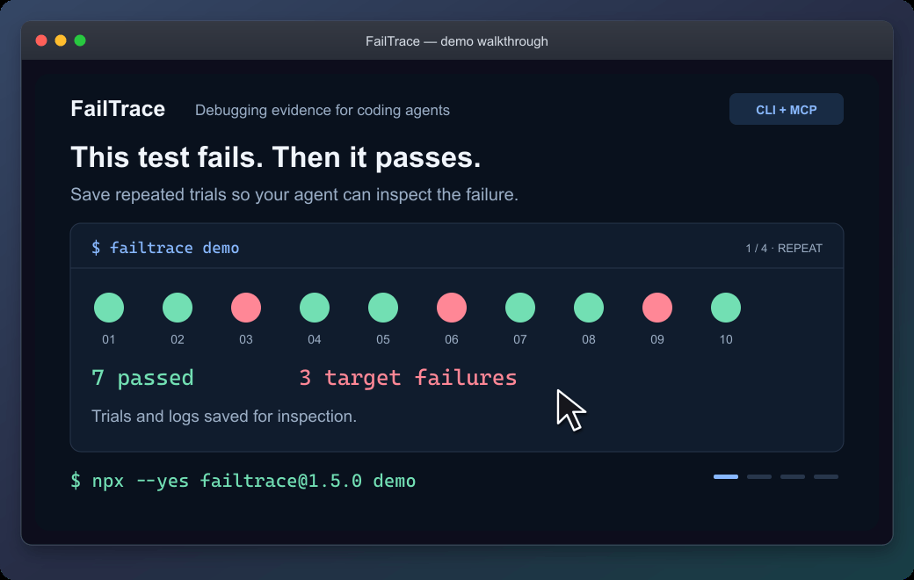

# FailTrace

**Debugging experiments for AI coding agents and developers.**

Turn a hard-to-reproduce failure into saved trials, a smaller reproducer, and evidence you can inspect after a proposed fix.

Use FailTrace from the **CLI or an MCP client** to repeat commands, compare failures, isolate regressions, minimize inputs, verify patches, and package a replay. Everything runs locally. No AI API, account, or telemetry is required.

[](https://github.com/LBarimi/FailTrace/actions/workflows/ci.yml)
[](LICENSE)

**[Try the demo](#quick-start)** · **[Connect your coding agent](docs/AGENT-WORKFLOWS.md)** · **[Use your own command](#use-it-on-your-own-failure)**

## Quick start

Requires **Node.js 22.12+ and npm**. Run from any directory:

```sh
npx --yes failtrace@1.1.0 demo
```



Recorded from the controlled CLI demo; output is abridged and timing edited. [Static version](docs/assets/demo-poster.png) · [Full results and limits](docs/DEMO.md) · [Install for everyday use](docs/INSTALL.md)

The demo saves its evidence under `.failtrace/` and prints a command to replay the reduced failure.

## For coding agents

Give your agent a consistent way to run debugging experiments and return the evidence behind its conclusions.

- **Follow the same failure.** Define a target message, exit code, or regular expression before investigating.
- **Inspect saved work.** Get structured counts and bounded summaries, then page through the trial logs you need without running the command again.
- **Recheck a patch.** Verify compares a candidate with a captured baseline and separates target observations from unrelated errors or incomplete evidence.

Connect the local stdio MCP server through your client's configuration:

```sh
npx --yes failtrace@1.1.0 mcp --cwd "/absolute/path/to/your/project"
```

**[Connect your MCP client and try an investigation →](docs/AGENT-WORKFLOWS.md)**

Your client launches this command; running it alone in a terminal waits for MCP requests. The guide covers Windows command shims and an optional project instruction snippet.

Then try asking your agent:

> Use FailTrace to investigate this intermittent test failure. Choose its failure signature, run a bounded sample, compare a healthy trial with a matching failure, and explain what the evidence supports. Capture a baseline before editing, then verify the proposed change.

Seven tools expose the same Core engine: `failtrace_run`, `failtrace_compare`, `failtrace_bisect`, `failtrace_minimize`, `failtrace_verify`, `failtrace_bundle`, and the read-only `failtrace_inspect_run`. Agents that use a shell can call the CLI with `--json`.

An installed MCP server makes the tools available; the agent still chooses when to use them. A healthy sample with no target observed does not prove a bug is gone.

## Use it on your own failure

Run this from your project, replacing the command and error message with your own:

```sh
npx --yes failtrace@1.1.0 run "npm test -- checkout" --repeat 20 --stderr-contains "checkout failed"
```

FailTrace saves each trial's output and prints an investigation ID. Exit `1` can mean the failure you are investigating was recorded. Add `--json` for automation, and use the [command reference](docs/CLI.md) to inspect or continue that investigation.

For repeated use, [save the experiment settings in your project scripts](docs/PROJECT-WORKFLOW.md) and capture a baseline before changing code.

| When you need to… | Use | What you get |
| --- | --- | --- |
| Measure an intermittent failure | `run` | Recorded outcomes, target matches, durations, and logs |
| Inspect a passing and failing attempt | `compare` | Bounded output differences, full hashes, and selected environment changes |
| Locate a regression | `bisect` | Repeated candidate trials and a sampled boundary on Git's first-parent history |
| Shrink a large reproducer | `minimize` | Reduced text, JSON, files, or environment keys, with a separate final check |
| Check a proposed fix | `verify` | Target observations and execution health against a captured baseline |
| Retrieve omitted agent evidence | `failtrace_inspect_run` | Saved trial pages and bounded output, without executing a command |
| Hand the investigation to someone else | `bundle` | Selected source/input, a manifest, and replay scripts |

The target command can use any runtime; FailTrace itself requires Node.js. Input reduction needs your command to read the candidate input. [CLI reference](docs/CLI.md) · [Verify workflow](docs/VERIFY.md) · [Bundle guide](docs/BUNDLES.md)

## What the results establish

- Repetition and Bisect report observations under chosen settings. They do not provide statistical confidence; concurrency can change failure behavior.
- Minimization rechecks its result but does not promise the smallest possible input. Check `status` and `finalVerified`.
- Verify's `target_not_observed` means no target match in a healthy, comparable sample. It does not prove that the intended test path ran or that the defect was eliminated.
- Bundles include selected files and the Node Core engine. Target dependencies, services, and uncaptured environment state still need setup.
- Commands run with your local permissions. Cleanup is best effort. Logs, commands, source, and inputs can contain private information: review them before sharing.

[Result and exit-code details](docs/CLI.md#artifacts-and-exit-codes) · [Resource limits](docs/RESOURCE-LIMITS.md) · [Performance scope](docs/PERFORMANCE.md)

## Availability and contributing

**1.1.0 is published on npm and as a [GitHub release](https://github.com/LBarimi/FailTrace/releases/tag/v1.1.0).** The commands above use that exact package. See [installation alternatives](docs/INSTALL.md), the [1.x compatibility contract](docs/COMPATIBILITY.md), and [migration from 0.x](docs/MIGRATING-TO-1.md).

Version 1.1.0 adds stricter Bisect exit policies, target-first comparison, and clearer CLI diagnostics. Review the migration notes when upgrading existing workflows. [Changes and migration notes](CHANGELOG.md#110) · [Product roadmap](docs/ROADMAP.md)

**Prepared for 1.2.0; publication pending:** [trace a lost data revision or an overlapping update](docs/WORKFLOWS.md) using original runnable examples. They reduce a reproducer and distinguish a working patch from a checker that was silently skipped using [completed-check signals](docs/EXECUTION-EVIDENCE.md). The published commands above continue to use 1.1.0.

The source also provides a [read-only storage inventory](docs/ARTIFACTS.md) for retained evidence and known investigation references.

For existing programs that accept an input-file argument, the 1.2.0 [direct execution mode](docs/DIRECT-EXECUTION.md) passes literal arguments and can bind the reduced input without modifying the program. Command-specific help explains each operation and its next steps.

**[Tell us where FailTrace helped or got stuck →](https://github.com/LBarimi/FailTrace/issues/new?template=workflow.yml)**

A first-install problem, a useful investigation, or a second use on your own project helps decide what to improve. Private logs are optional. Our goal is useful, repeated adoption by people and agents.

To work on the source:

```sh
git clone https://github.com/LBarimi/FailTrace.git
cd FailTrace
npm ci
npm test
npm run typecheck
npm run demo
```

`npm test` builds the source first. Core is also an ESM TypeScript API exported by `failtrace`; CLI and MCP call the same engine. [Contributing](CONTRIBUTING.md) · [Implementation](docs/IMPLEMENTATION.md) · [Adoption priorities](docs/ADOPTION.md)
